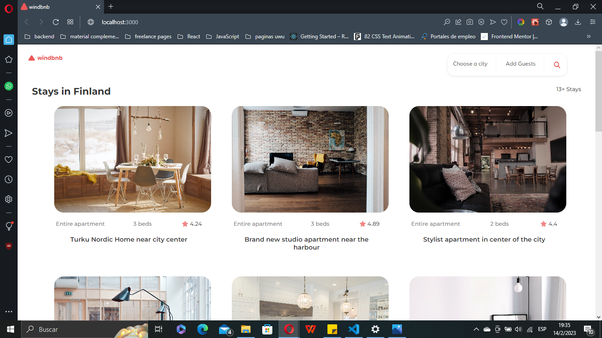

<!-- Please update value in the {}  -->

<h1 align="center">Windbnb</h1>

<div align="center">
   Solution for a challenge from  <a href="http://devchallenges.io" target="_blank">Devchallenges.io</a>.
</div>

<div align="center">
  <h3>
    <a href="https://windbnb-blond.vercel.app">
      Demo
    </a>
    <span> | </span>
    <a href="https://github.com/romartinez927/Windbnb.git">
      Solution
    </a>
    <span> | </span>
    <a href="https://devchallenges.io/challenges/3JFYedSOZqAxYuOCNmYD">
      Challenge
    </a>
  </h3>
</div>

<!-- TABLE OF CONTENTS -->

## Table of Contents

- [Overview](#overview)
- [Built With](#built-with)
- [Features](#features)
- [How to use](#how-to-use)
- [Contact](#contact)

<!-- OVERVIEW -->

## Overview



Buenaas, me llamo Rosario, y este es mi solución para el desafío de Devchallenge

- Where can I see your demo?
Puedes ver el demo en https://windbnb-blond.vercel.app
- What was your experience?
Fue una buena experiencia, me gustó mucho el resultado final y me sirvió mucho para profundizar un poco más en React, aunque también me hizo ver que todavía me falta mucho para aprender! 
- What have you learned/improved?
Aprendí que la mejor forma de aprender es haciendo proyectos, después de haber terminado el curso de React creía que lo entendía, pero haciendo este proyecto me di cuenta que habían temas que tenía que repasar. Ahora me siento un poco más segura en cuanto al uso del Framework, y para mi próximo proyecto continuaré profundizandolo aún más.
- Your wisdom? :)
No dejes para mañana lo que podes hacer hooooy!!

### Built With

<!-- This section should list any major frameworks that you built your project using. Here are a few examples.-->

- [React](https://reactjs.org/)
- [Bootstrap](https://getbootstrap.com)
- [React-Bootstrap](https://react-bootstrap.github.io)
- [Firebase](https://firebase.google.com/)

## Features

<!-- List the features of your application or follow the template. Don't share the figma file here :) -->

This application/site was created as a submission to a [DevChallenges](https://devchallenges.io/challenges) challenge. The [challenge](https://devchallenges.io/challenges/3JFYedSOZqAxYuOCNmYD) was to build an application to complete the given user stories.

## How To Use

<!-- Example: -->

To clone and run this application, you'll need [Git](https://git-scm.com) and [Node.js](https://nodejs.org/en/download/) (which comes with [npm](http://npmjs.com)) installed on your computer. From your command line:

```bash
# Clone this repository
$ git clone https://github.com/romartinez927/Windbnb

# Install dependencies
$ npm install

# Run the app
$ npm start
```


## Contact

- Portafolio [Portafolio](https://romartinez927.github.io/Portafolio/)
- GitHub [@romartinez927](https://github.com/romartinez927)

